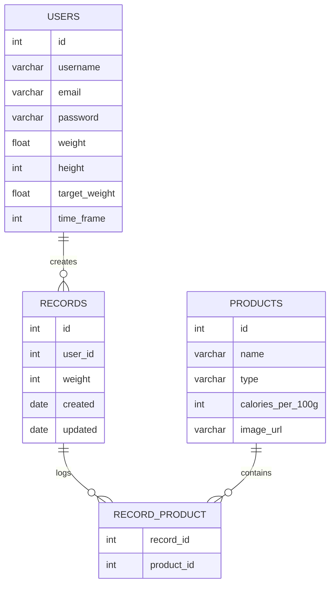

# Calorie Tracker Project

## Overview

The **Calorie Tracker** is designed to help users monitor and control their daily calorie intake. The primary goal is to provide an intuitive, efficient, and accessible tool for calorie tracking.

### Key Features

- **Create and Manage Products**: Add food items with their calorie details.
- **Create Dishes**: Combine existing products into meals, with automatic calorie calculations.
- **Log Daily Entries**: Record meals consumed, edit or delete entries, and view overall calorie summaries.
- **Calculate Calorie Allowance**: Automatically compute a user's daily calorie limit based on BMI.

---

## Project Structure

The application is divided into two parts:

### Frontend

- **Technology**: ReactJS
- **Purpose**: Delivers an interactive and seamless user experience.

### Backend

- **Technology**: FastAPI
- **Purpose**: Handles core logic, data storage, and business processes.

---

## Technologies

### Backend

- **FastAPI**: Asynchronous, high-performance framework with built-in data validation and documentation.
- **SQLModel**: Combines features of SQLAlchemy and Pydantic for defining database models.
- **JWT**: Secure and stateless authentication.
- **bcrypt**: Ensures secure password hashing.
- **OAuth2PasswordBearer**: Manages token-based user authorization.

### Frontend

- **ReactJS**: Component-based architecture for reusable and efficient UI development.

### Database

- **SQLite**: Used for development; can be replaced with PostgreSQL for production.

---

## Project Structure

Inspired by common practices in ExpressJS applications:

- **Controllers**: Handle all CRUD operations.
- **Models**: Define database schema using SQLModel classes.
- **Routes**: Modular and maintainable routes for each entity.
- **Static**: Store user-uploaded images and static files.

---

## Features and Functionality

### Frontend (ReactJS)

- **Registration and Login**: Secure sign-up and login with JWT-based session management.
- **Dashboard**:
  - Displays daily calorie allowance based on BMI.
  - Options to:
    - **Create Products**: Add products with calorie details.
    - **Create Dishes**: Combine products into dishes.
    - **Log Entries**: Record meals.
  - Summary table of consumed products and total calories.

### Backend (FastAPI)

- **Authentication**:
  - User registration with secure password handling.
  - JWT token-based login.
- **CRUD Operations**:
  - Manage users, products, and records.
  - Define relationships:
    - Users → Entries (One-to-Many).
    - Entries ↔ Products (Many-to-Many).
- **Endpoints**:
  - `/users`: User management.
  - `/products`: Product management.
  - `/records`: Record daily meals and view calorie consumption.

---

## Next Steps

1. Finalizing frontend features and improving user experience.
2. Adding sorting, filtering, and reporting tools for calorie tracking.
3. Upgrading to a production-grade database for scalability.

---

## Database Schema

The database schema is structured to represent relationships between users, products, and records. Below is the ER diagram:

